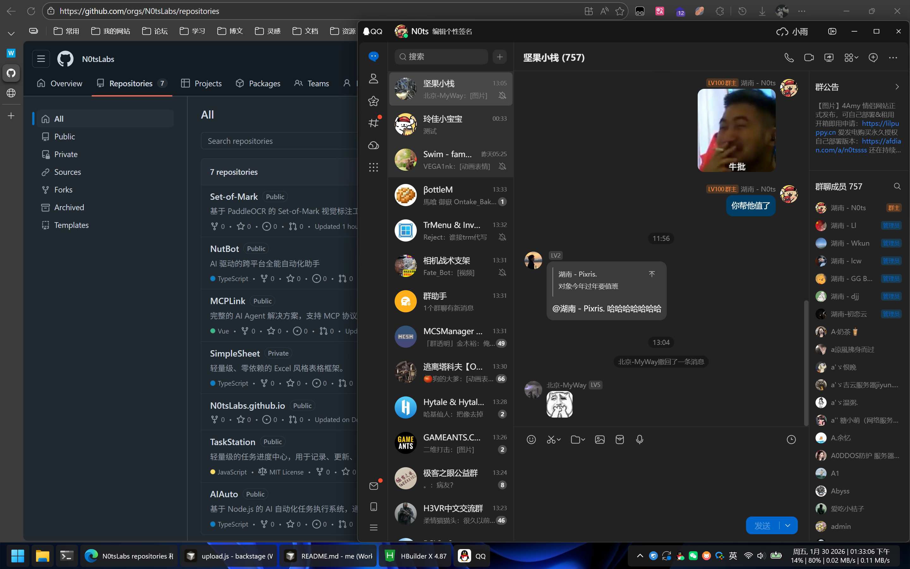
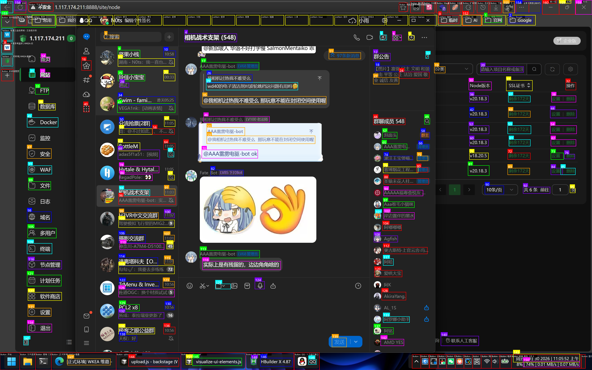

# OCR-SoM

基于 PaddleOCR + OpenCV 的屏幕元素标注工具，专为 **AI 自动化** 设计。

> 🤖 配合 [NutBot](https://github.com/N0tsLabs/NutBot) 使用，实现 AI 精准操控电脑

## 为什么需要这个？

**问题**：让 AI 点击屏幕上的按钮时，AI 给的坐标经常不准。

**原因**：AI 视觉模型（如 GPT-4V）虽然能"看懂"图片，但给出的像素坐标往往有偏差。

**解决方案 - Set-of-Mark (SoM)**：
1. 用 OCR 识别屏幕上所有文字和 UI 元素
2. 给每个元素标上编号 `[0] [1] [2]...`
3. 把标注图发给 AI
4. AI 只需说"点击 42 号"
5. 程序根据编号查出**精确坐标**

**结果**：AI 不用猜坐标，坐标由程序保证精确。

## 效果展示

| 原始截图 | SoM 标注后 |
|---------|-----------|
|  |  |

每个可交互元素都被框出来并标上了编号，AI 只需要说出编号即可精准定位。

## 技术实现

```
截图 → PaddleOCR (文字识别) → OpenCV (UI轮廓检测) → 编号标注 → 输出
         ↓                        ↓
    识别所有文字              检测图标、按钮等
    返回精确坐标              非文字可点击元素
```

**核心组件：**
- **PaddleOCR** - 识别中英文文字，返回文字内容和边界框
- **OpenCV** - 通过边缘检测、颜色分析识别 UI 轮廓（图标、按钮等）
- **Flask** - 提供 HTTP API，方便各种语言调用

## 快速开始

### 安装

```bash
# Windows 双击 install.bat 或运行：
python install.py

# Linux/Mac
./install.sh
```

安装脚本会：
- 自动检测 GPU，有 NVIDIA 显卡会安装 GPU 版本（快 5 倍）
- 安装 PaddleOCR、OpenCV、Flask 等依赖

### 启动服务

```bash
python server.py
```

启动后打开 http://localhost:5000 可以使用网页界面测试。

## API 接口

### POST /som - 生成标注图

```bash
curl -X POST http://localhost:5000/som \
  -F "file=@screenshot.png"
```

返回：
```json
{
  "success": true,
  "count": 42,
  "elements": [
    {"id": 0, "type": "text", "text": "文件", "box": [10, 20, 50, 40]},
    {"id": 1, "type": "text", "text": "编辑", "box": [60, 20, 100, 40]},
    {"id": 2, "type": "ui", "text": "", "box": [200, 100, 240, 140]}
  ],
  "marked_image": "base64..."
}
```

- `id`: 编号（与标注图上的数字对应）
- `type`: `text`（OCR文字）或 `ui`（轮廓检测的UI元素）
- `box`: 坐标 `[左, 上, 右, 下]`
- `marked_image`: 标注图的 base64

### POST /ocr - 仅文字识别

```bash
curl -X POST http://localhost:5000/ocr \
  -F "file=@screenshot.png"
```

### GET /health - 健康检查

```bash
curl http://localhost:5000/health
```

## 与 NutBot 配合使用

[NutBot](https://github.com/N0tsLabs/NutBot) 是一个 AI 驱动的自动化助手，OCR-SoM 为它提供精确的屏幕元素定位能力。

**工作流程：**
```
用户: "帮我打开微信给张三发消息"
          ↓
NutBot: 截取屏幕
          ↓
NutBot: 调用 OCR-SoM API 获取标注图和元素列表
          ↓
NutBot: 把标注图发给 AI，问"微信图标是哪个编号？"
          ↓
AI: "是 15 号"
          ↓
NutBot: 从元素列表找到 15 号的坐标，点击
          ↓
精准命中！
```

## 参数配置

网页界面提供了参数设置面板，可以调整：

| 参数 | 作用 |
|-----|------|
| 仅 OCR | 只识别文字，不检测 UI 轮廓（速度更快） |
| 最小/最大面积 | 过滤过小或过大的检测区域 |
| 填充率阈值 | 调整实心/空心区域的检测灵敏度 |
| 饱和度阈值 | 调整彩色图标的检测灵敏度 |

## 文件结构

```
ocr-som/
├── server.py        # API 服务（主程序）
├── ocr_som.py       # 命令行工具
├── install.py       # 跨平台安装脚本
├── install.bat      # Windows 一键安装
├── install.sh       # Linux/Mac 安装
├── web/
│   └── index.html   # 网页界面
├── models/          # OCR 模型（首次运行自动下载）
└── docs/            # 文档和示例图
```

## 常见问题

### 安装失败？
确保有 Python 3.9-3.11。Windows 从 https://python.org 下载。

### GPU 加速？
安装时自动检测 NVIDIA GPU。有 GPU 约快 5 倍。

### 某些文字没识别到？
可以在设置中调低「最小面积」和「最小尺寸」参数。

### 框框太多太乱？
使用「纯 OCR」预设，或调高「最小面积」参数。

## License

MIT

---

Made with ❤️ by [N0ts](https://github.com/N0tsLabs)
